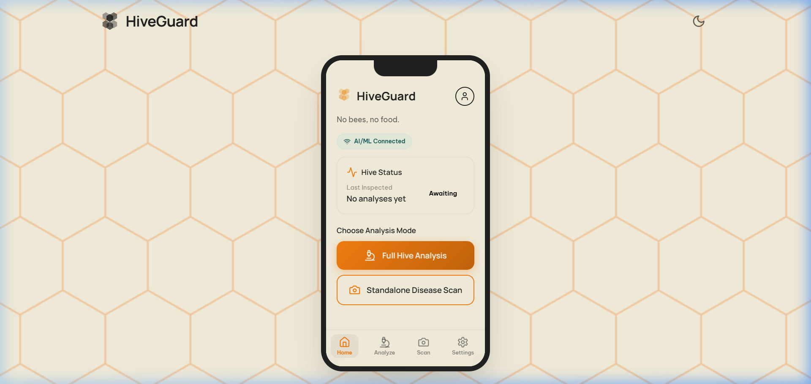
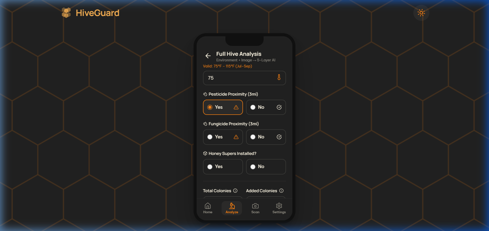
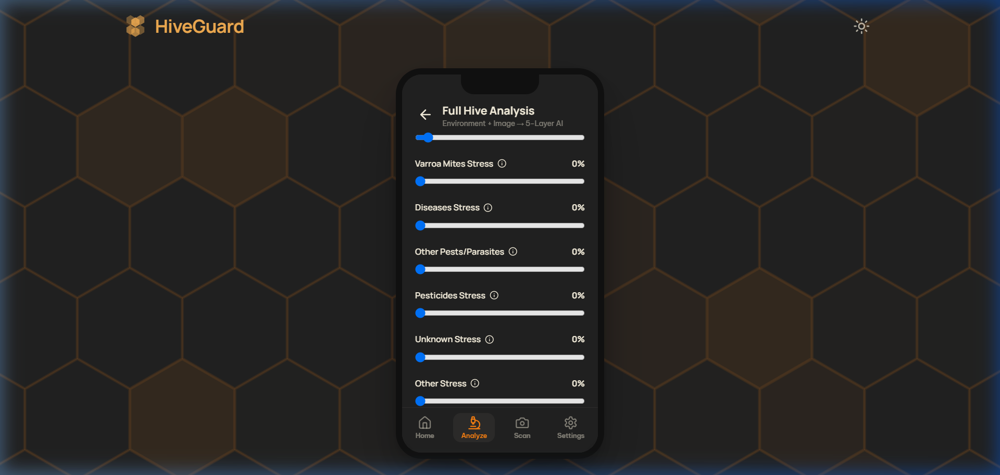
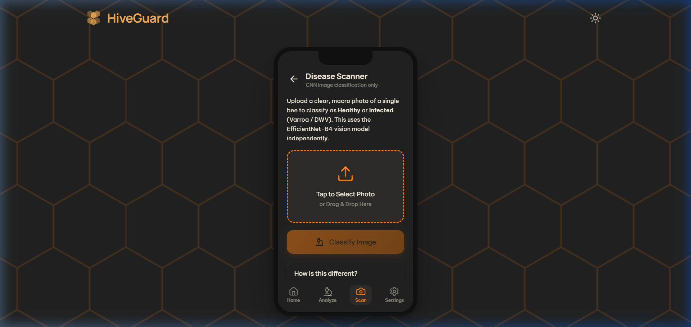
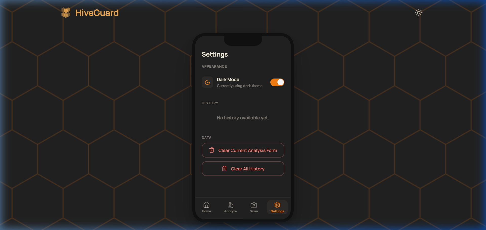

<p align="center">
  
</p>

<h1 align="center">HiveGuard</h1>
<h3 align="center">AI-Powered Colony Collapse Prediction & Intelligent Intervention System</h3>

<p align="center">
  <em>Because no bees means no food.</em>
</p>

<p align="center">
  <a href="https://hiveguard.netlify.app/">
    
  </a>
  <a href="https://github.com/Asma-Shoukat/Hiveguard">
    
  </a>
</p>

<p align="center">
  
  
  
  
  
  
  
  
</p>

---

## 📋 Table of Contents

- [Overview](#-overview)
- [System Architecture](#-system-architecture)
- [The 4-Layer AI Pipeline](#-the-4-layer-ai-pipeline)
  - [Layer 1 — Sensor Fusion](#layer-1--sensor-fusion)
  - [Layer 2 — A* Search Agent](#layer-2--a-search-agent)
  - [Layer 3 — Forward-Chaining Knowledge Base](#layer-3--forward-chaining-knowledge-base)
  - [Layer 4 — Beekeeper Prescription](#layer-4--beekeeper-prescription)
- [Machine Learning Models](#-machine-learning-models)
  - [Tabular Stacking Ensemble](#-tabular-stacking-ensemble-macro-sensor)
  - [CNN Vision Model](#-cnn-vision-model-micro-sensor)
- [Tech Stack](#-tech-stack)
- [System Pics](#-system-pics)
- [Project Structure](#-project-structure)
- [Getting Started](#-getting-started)
- [API Reference](#-api-reference)
- [Key Features](#-key-features)
- [Data Engineering](#-data-engineering-pipeline)
- [Biological Rules Engine](#-biological-rules-engine)
- [Contributing](#-contributing)
- [License](#-license)

---

## 🌍 Overview

**HiveGuard** is a **100% software-based predictive ecosystem** that acts as a *virtual sensor* to predict honey bee colony collapse risk. By fusing geospatial environmental data with computer vision, the system **replaces expensive physical IoT hardware** — democratizing predictive apiculture for beekeepers worldwide.

> 🐝 **The Problem:** Colony Collapse Disorder (CCD) has caused the loss of ~40% of managed honey bee colonies annually in the US. Traditional monitoring requires expensive IoT sensors ($200–$500 per hive) that most beekeepers cannot afford.
>
> 💡 **Our Solution:** HiveGuard uses publicly available USDA data, climate records, and smartphone photos to deliver the same predictive power at **zero hardware cost**.

The project features a **Hybrid AI Architecture**: a dual-stream Machine Learning layer (Tabular Stacking Ensemble + Deep Learning CNN) for probabilistic risk forecasting, paired with a deterministic Symbolic AI layer (A\* Search + Forward-Chaining Knowledge Base) to autonomously generate **mathematically optimized and biologically safe** intervention strategies.

---

## 🏗 System Architecture

```
┌─────────────────────────────────────────────────────────────────────┐
│                        HIVEGUARD ARCHITECTURE                       │
├─────────────────────────────────────────────────────────────────────┤
│                                                                     │
│  ┌─────────────────┐      ┌──────────────────────────────────────┐ │
│  │   React 19 UI   │◄────►│        FastAPI Backend (Python)       │ │
│  │   (Vite + JSX)  │ REST │                                      │ │
│  │                 │ API  │  ┌──────────────────────────────────┐ │ │
│  │  • Dashboard    │      │  │     LAYER 1: SENSOR FUSION       │ │ │
│  │  • Analysis Form│      │  │  ┌────────────┐ ┌─────────────┐ │ │ │
│  │  • Vision Scan  │      │  │  │  Stacking   │ │ EfficientNet│ │ │ │
│  │  • Results View │      │  │  │ Ensemble v1 │ │  B4 (ONNX)  │ │ │ │
│  │  • Settings     │      │  │  │ (Tabular ML)│ │ (Vision CNN)│ │ │ │
│  │                 │      │  │  └──────┬──────┘ └──────┬──────┘ │ │ │
│  └─────────────────┘      │  │         └───────┬───────┘        │ │ │
│                           │  │                 ▼                 │ │ │
│                           │  │        Fused Initial State        │ │ │
│                           │  └──────────────┬───────────────────┘ │ │
│                           │                 ▼                     │ │
│                           │  ┌──────────────────────────────────┐ │ │
│                           │  │     LAYER 2: A* SEARCH AGENT     │ │ │
│                           │  │  Optimal Intervention Pathfinder │ │ │
│                           │  │  (Priority Queue + Heuristic)    │ │ │
│                           │  └──────────────┬───────────────────┘ │ │
│                           │                 ▼                     │ │
│                           │  ┌──────────────────────────────────┐ │ │
│                           │  │  LAYER 3: KNOWLEDGE BASE (XAI)   │ │ │
│                           │  │  13 IF-THEN Entomological Rules  │ │ │
│                           │  │  Forward Chaining + VETO Power   │ │ │
│                           │  └──────────────┬───────────────────┘ │ │
│                           │                 ▼                     │ │
│                           │  ┌──────────────────────────────────┐ │ │
│                           │  │   LAYER 4: PRESCRIPTION ENGINE   │ │ │
│                           │  │  Plain-English Action Plan +     │ │ │
│                           │  │  Diagnosis + Warnings + PDF      │ │ │
│                           │  └──────────────────────────────────┘ │ │
│                           └──────────────────────────────────────┘ │
└─────────────────────────────────────────────────────────────────────┘
```

---

## 🧠 The 4-Layer AI Pipeline

When a beekeeper submits an analysis, HiveGuard executes a **sequential 4-layer AI pipeline**. Each layer builds upon the previous one's output:

### Layer 1 — Sensor Fusion

**File:** [`sensor_fusion.py`](backend/sensor_fusion.py)

Fuses two independent ML models into a single unified hive state:

| Model | Type | Input | Output |
|-------|------|-------|--------|
| **Stacking Ensemble v1** | Tabular ML (XGBoost + GBM + RF → LogReg meta) | 19 environmental features | Regional Risk: `Low` / `Medium` / `Severe` |
| **EfficientNet-B4** | CNN via ONNX Runtime | Bee specimen photo(s) | Varroa Status: `Healthy` / `Infected` + Infection Rate |

The fusion engine combines both outputs with pesticide stress data into an **initial state dictionary** that feeds downstream layers.

---

### Layer 2 — A\* Search Agent

**File:** [`a_star_agent.py`](backend/a_star_agent.py)

A classical AI search algorithm that finds the **minimum-cost, biologically legal intervention path** to transition the hive from a dangerous state to a safe "Low Risk" state.

**How it works:**
1. **State Space:** Each state is defined by `(Regional_Risk, CNN_Varroa, Pesticide_Risk)`
2. **Actions:** 8 real-world beekeeping interventions (Oxalic Acid, Formic Pro, Amitraz, Thymol, HopGuard 3, Syrup Feeding, Hive Relocation, OAE)
3. **Cost Function:** `Expected Cost = Base Cost ÷ Efficacy Probability`
4. **Heuristic:** Admissible heuristic estimating minimum remaining cost
5. **Constraint Engine:** 12 biological rules that reject unsafe actions (temperature limits, honey super conflicts, colony size requirements)

**Example output:**
```
Step 1: Relocate Hive (cost: 95.0, efficacy: 100%)
  → Break environmental toxicity loop
Step 2: Extended-Release Oxalic Acid (cost: 36.8, efficacy: 95%)
  → Kill phoretic mites over 60 days
Total intervention cost: 131.8 units
```

---

### Layer 3 — Forward-Chaining Knowledge Base

**File:** [`knowledge_base.py`](backend/knowledge_base.py)

A deterministic **Symbolic AI inference engine** with 13 IF-THEN entomological rules that:

- **Chains biological deductions** from ML outputs (e.g., CNN detects DWV → Mite Load = High → Winter Fat Body Depletion)
- **Holds VETO POWER** over the A\* agent to prevent biologically fatal decisions
- Detects lethal synergies (pesticide × fungicide × miticide interactions)
- Implements the **PEAS framework** for explainable AI

| Rule | Name | Trigger |
|------|------|---------|
| R1 | CNN DWV Trigger | Visual DWV detection → High Mite Load |
| R3 | Neonicotinoid Synergy | High mites + Pesticide → Detoxification Failure |
| R4 | Cyanoamidine Synergy | Pesticide + Fungicide → Lethal Synergy |
| R5 | Treatment Toxicity Loop | Lethal Synergy + Amitraz → Cancel Treatment |
| R7 | Winter Death Trap | Q1/Q4 + High Mites → Winter Fat Body Depletion |
| R11 | Emergency Relocation | Lethal Synergy → Relocate Hive |
| R13 | Multi-Modal Synergy | CNN Infected + Severe Regional Risk → Critical |

---

### Layer 4 — Beekeeper Prescription

**File:** [`prescription.py`](backend/prescription.py)

Translates all AI outputs into a **farmer-readable action plan** containing:

- **🩺 Diagnosis:** Deduced biological facts with severity levels
- **📋 Action Plan:** Step-by-step intervention protocol with costs and efficacy
- **⚠️ Warnings:** KB vetoes and biological safety overrides
- **📊 Prognosis:** Overall risk assessment (Critical / Moderate / Stable)

Supports **PDF export** via html2pdf.js for offline field use.

---

## 📊 Machine Learning Models

### 📈 Tabular Stacking Ensemble (Macro Sensor)

A state-of-the-art multi-model stacking architecture for colony collapse risk prediction:

| Component | Detail |
|-----------|--------|
| **Base Learners** | XGBoost + Gradient Boosting + Random Forest |
| **Meta-Learner** | Logistic Regression |
| **Pre-trained Transformer** | TabPFN (ROC-AUC: **0.8454**) |
| **Final Performance** | 70.54% accuracy, ROC-AUC: **0.8320** |
| **Recall Optimization** | Threshold: 0.50 → **0.34** for 'Severe' class |
| **Spatial Validation** | 5-Fold GroupKFold by US State FIPS codes |
| **Features** | 19 engineered features from 5 public datasets |

> **Design Philosophy:** Prioritized biological safety by maximizing recall on the 'Severe' collapse class — dangerous colony states are never silently missed.

---

### 🔬 CNN Vision Model (Micro Sensor)

A parameter-efficient Convolutional Neural Network for visual diagnosis of *Varroa destructor* mite infections:

| Component | Detail |
|-----------|--------|
| **Architecture** | EfficientNet-B4 with MBConv + SE modules |
| **Training Framework** | PyTorch (`timm` library) |
| **Dataset** | 13,509 images from TU Wien VarroaDataset |
| **Deployment** | ONNX Runtime (74 MB, CPU-only, sub-second inference) |
| **Input** | 280×160 RGB images, ImageNet normalized |
| **Output** | Binary classification: Healthy / Infected |

---

## 🛠 Tech Stack

### Frontend
| Technology | Purpose |
|-----------|---------|
| **React 19** | UI framework with hooks & context API |
| **Vite 6** | Build tool & dev server |
| **Lucide React** | Icon system |
| **html2pdf.js** | PDF report generation |
| **react-hexgrid** | Hexagonal grid visualization |

### Backend
| Technology | Purpose |
|-----------|---------|
| **FastAPI** | REST API server |
| **ONNX Runtime** | Vision model inference (CPU) |
| **scikit-learn** | Tabular model loading & prediction |
| **XGBoost** | Base learner in stacking ensemble |
| **Pillow** | Image preprocessing |
| **joblib** | Model serialization |
| **Docker** | Containerized deployment |

---

## 📸 System Imgs:

## 🖼️ Live Application Screenshots

Here are the live screenshots of the HiveGuard system running locally with active AI/ML engines.

---

<h3 align="center">🏠 Dashboard (Home Screen)</h3>

<p align="center">
  
  <p align="center">
  <b>☀️ Light Mode</b>
  &nbsp;&nbsp;&nbsp;&nbsp;&nbsp;&nbsp;&nbsp;&nbsp;
  
    <b>🌙 Dark Mode</b>
</p>

<p align="center">
 
</p>

---

<h3 align="center">🔬 Core Functional Screens</h3>

<p align="center">
  
  &nbsp;&nbsp;&nbsp;
  
  &nbsp;&nbsp;&nbsp;
  
</p>

<p align="center">
  <b>📋 Full Hive Analysis</b>
  &nbsp;&nbsp;&nbsp;&nbsp;&nbsp;&nbsp;&nbsp;&nbsp;&nbsp;&nbsp;
  <b>📷 Disease Scanner</b>
  &nbsp;&nbsp;&nbsp;&nbsp;&nbsp;&nbsp;&nbsp;&nbsp;&nbsp;&nbsp;
  <b>⚙️ App Settings</b>
</p>

---

<h2 align="center">🧠 AI Pipeline Results</h2>

<p align="center">
  Complete AI reasoning pipeline demonstrating sensor fusion, knowledge-based inference,
  and AI-generated beekeeper recommendations.
</p>

<p align="center">
  

  

  
</p>

<p align="center">
  <b>📊 Sensor Fusion + A*</b>
  &nbsp;&nbsp;&nbsp;&nbsp;&nbsp;&nbsp;&nbsp;
  <b>📜 Knowledge Base Inference</b>
  &nbsp;&nbsp;&nbsp;&nbsp;&nbsp;&nbsp;&nbsp;
  <b>🩺 Beekeeper Prescription</b>
</p>
## 📁 Project Structure

```
HiveGuard/
├── 📄 index.html                   # Vite entry point
├── 📄 package.json                 # Node.js dependencies & scripts
├── 📄 vite.config.js               # Vite configuration
├── 📄 requirements.txt             # Python dependencies
├── 📄 run_app.py                   # One-command startup script
│
├── 📂 src/                         # React Frontend
│   ├── 📄 main.jsx                 # React entry point
│   ├── 📄 App.jsx                  # Root component + screen router
│   ├── 📄 index.css                # Complete design system (56KB)
│   ├── 📂 context/
│   │   └── 📄 AppContext.jsx       # Global state management + API calls
│   └── 📂 components/
│       ├── 📄 Navbar.jsx           # Top navigation bar + theme toggle
│       ├── 📄 HoneycombLogo.jsx    # Custom SVG honeycomb logo
│       ├── 📄 BackgroundTexture.jsx # Animated background
│       ├── 📄 FloatingElements.jsx  # Decorative floating particles
│       ├── 📄 PhoneFrame.jsx       # Mobile phone frame wrapper
│       ├── 📄 ImageOrientationModal.jsx # Image rotation tool for CNN
│       └── 📂 app/
│           ├── 📄 BottomNav.jsx    # Bottom navigation (4 tabs)
│           ├── 📄 DashboardScreen.jsx # Home screen + history
│           ├── 📄 TabularScreen.jsx   # Full analysis form (19 inputs)
│           ├── 📄 VisionScreen.jsx    # Standalone disease scanner
│           ├── 📄 ScanResultScreen.jsx # CNN scan results
│           ├── 📄 ResultsScreen.jsx   # 4-layer pipeline results + PDF
│           └── 📄 SettingsScreen.jsx  # Dark mode + history management
│
├── 📂 backend/                     # Python FastAPI Backend
│   ├── 📄 app.py                   # FastAPI server + REST endpoints
│   ├── 📄 sensor_fusion.py         # Layer 1: ML model loading & fusion
│   ├── 📄 a_star_agent.py          # Layer 2: A* search pathfinder
│   ├── 📄 knowledge_base.py        # Layer 3: Forward-chaining KB (13 rules)
│   ├── 📄 prescription.py          # Layer 4: Action plan generator
│   ├── 📄 climate_rules.py         # Climate-season temperature validation
│   ├── 📄 state_data.py            # US state encodings (USDA loss rates)
│   ├── 📄 requirements.txt         # Python dependencies
│   ├── 📄 Dockerfile               # Docker container config
│   └── 📂 models/                  # ML model artifacts (git-ignored)
│       ├── 📄 Tabular_Stack_v1.pkl # Stacking Ensemble (~10 MB)
│       ├── 📄 Stack_v1_scaler.pkl  # Feature scaler
│       ├── 📄 T6_Model.onnx        # EfficientNet-B4 ONNX (~1.2 MB)
│       └── 📄 T6_Model.onnx.data   # ONNX weights (~74 MB)
│
├── 📂 New documents/               # Project documentation
│   ├── 📄 Dataset_Feature_Info.txt # 19-feature detailed documentation
│   └── 📄 Rules.txt               # Complete biological rules reference
│
└── 📂 public/
    └── 📄 favicon.svg              # HiveGuard favicon
```

---

## 🚀 Getting Started

### Prerequisites

- **Node.js** 18+ and **npm**
- **Python** 3.10+
- ML model files placed in `backend/models/` (see [Model Setup](#model-setup))

### 1. Clone the Repository

```bash
git clone https://github.com/Asma-Shoukat/Hiveguard.git
cd Hiveguard
```

### 2. Install Frontend Dependencies

```bash
npm install
```

### 3. Install Backend Dependencies

```bash
pip install -r backend/requirements.txt
```

### 4. Model Setup

Place the trained model files in the `backend/models/` directory:

| File | Size | Description |
|------|------|-------------|
| `Tabular_Stack_v1.pkl` | ~10 MB | Stacking Ensemble classifier |
| `Stack_v1_scaler.pkl` | ~2 KB | Feature scaler for tabular model |
| `T6_Model.onnx` | ~1.2 MB | EfficientNet-B4 ONNX graph |
| `T6_Model.onnx.data` | ~74 MB | ONNX model weights |

> ⚠️ Model files are not included in the repository due to their size. Contact the maintainers or train your own using the documented pipeline.

### 5. Run the Application

**Option A — One Command:**
```bash
python run_app.py
```

**Option B — Manual Start:**
```bash
# Terminal 1: Start Backend
cd backend
uvicorn app:app --reload --host 0.0.0.0 --port 8000

# Terminal 2: Start Frontend
npm run dev
```

The frontend opens at `http://localhost:5173` and connects to the backend at `http://localhost:8000`.

### Docker Deployment (Backend Only)

```bash
cd backend
docker build -t hiveguard-backend .
docker run -p 7860:7860 hiveguard-backend
```

---

## 📡 API Reference

| Endpoint | Method | Description |
|----------|--------|-------------|
| `/api/health` | `GET` | Health check — reports model availability |
| `/api/states` | `GET` | Returns sorted list of all 50 US states |
| `/api/climate/{state}/{quarter}` | `GET` | Valid temperature range for state + season |
| `/api/analyze` | `POST` | **Full 4-layer AI pipeline** (multipart form) |
| `/api/scan` | `POST` | **Standalone CNN disease scan** (image upload) |

### `POST /api/analyze` — Full Analysis

**Form Fields (16 required):**

| Field | Type | Description |
|-------|------|-------------|
| `state` | string | US state name |
| `quarter` | int | Season (1–4) |
| `temperature_f` | float | Ambient temperature (°F) |
| `pesticide_proximity` | bool | Pesticide use within 3 miles |
| `fungicide_proximity` | bool | Fungicide use within 3 miles |
| `honey_supers` | bool | Honey supers installed |
| `colony_n` | int | Total colonies managed |
| `colony_added` | int | Colonies added this quarter |
| `colony_reno_pct` | float | Colony renovation percentage |
| `stress_varroa_mites` | float | Varroa stress (0–100%) |
| `stress_diseases` | float | Disease stress (0–100%) |
| `stress_other_pests_parasites` | float | Other pests stress (0–100%) |
| `stress_pesticides` | float | Pesticide stress (0–100%) |
| `stress_unknown` | float | Unknown stress (0–100%) |
| `stress_other` | float | Other stress (0–100%) |
| `yield_per_colony` | float | Honey yield (lbs/colony) |
| `files` | File[] | Optional bee specimen photos |

**Response:** JSON with `sensor_fusion`, `a_star`, `knowledge_base`, and `prescription` objects.

---

## ✨ Key Features

| Feature | Description |
|---------|-------------|
| 🧠 **Hybrid AI** | ML probabilistic risk + Symbolic AI deterministic safety |
| 📊 **Dual-Model Fusion** | Tabular ensemble + CNN vision fused into single state |
| 🔍 **A\* Pathfinding** | Optimal-cost intervention path with constraint enforcement |
| 📜 **13-Rule Knowledge Base** | Entomological IF-THEN rules with veto power |
| 🌡️ **Climate Validation** | Temperature clamping by US climate zone × season |
| 📱 **Mobile-First UI** | Phone-frame design with dark mode support |
| 📄 **PDF Reports** | Downloadable analysis reports for field use |
| 🕐 **Analysis History** | Local storage of past analyses with replay |
| 🖼️ **Image Orientation** | Rotate uploaded photos to match CNN requirements |
| 🐳 **Docker Ready** | Containerized backend deployment |

---


## 🛡 Biological Rules Engine

The A\* Search Agent enforces **12 biological constraints** before recommending any treatment:

| Rule | Constraint | Prevents |
|------|-----------|----------|
| R1–R2 | Formic Pro: 50–85°F, ≥10,000 bees | Brood mortality, queen sterilization |
| R3–R4 | Thymol: 59–100°F, no honey supers | Honey contamination, vapor toxicity |
| R5–R6 | Amitraz: no supers, no fungicides | Illegal residues, P450 enzyme failure |
| R7–R8 | Oxalic Vapor: ≥37°F, Q1/Q4 only | Bee chilling, capped brood inefficacy |
| R9–R10 | HopGuard 3: ≥50°F, Q1/Q4 only | Contact failure, brood inefficacy |
| R11 | Syrup Feeding: ≥32°F | Freezing metabolism failure |

---


